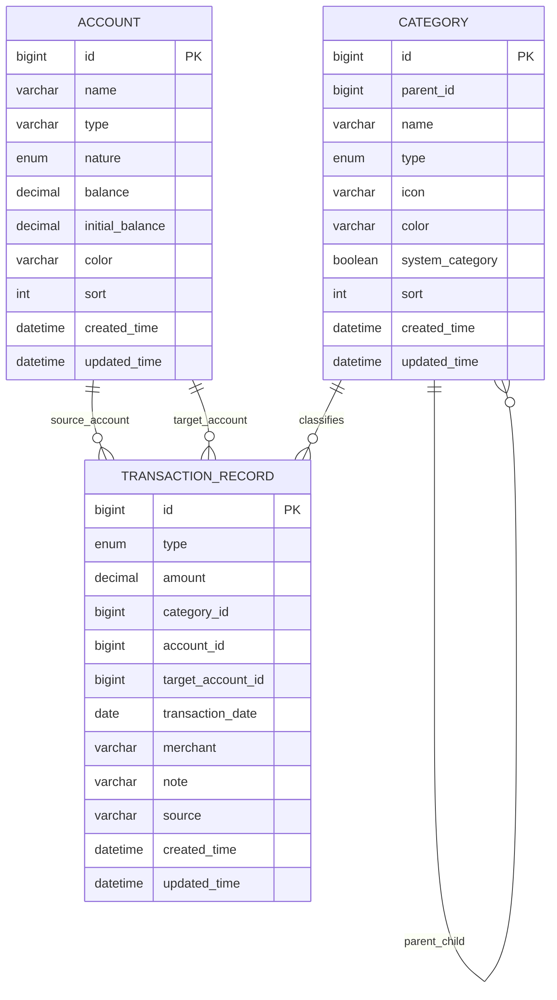

# Cost Count 业务逻辑说明

> 文档基于 2026-08-27 删除业务代码前的实际实现整理，用于需求留档和后续重建。
> 本文区分“已实现行为”和“重建建议”：前者忠实记录旧代码，后者不代表旧系统已经具备。

## 1. 产品定位与范围

Cost Count 是一个本地个人记账系统，目标是统一管理资产账户、负债账户、日常收支、账户转账和外部账单导入，并提供月度财务概览。

旧系统没有用户、账本、登录、权限、预算、周期账单和云同步概念，所有数据默认属于当前本地使用者的唯一账本。

核心业务模块：

1. 资金账户：维护资产和负债账户及其当前金额。
2. 收支分类：维护收入、支出的两级分类树。
3. 日常流水：记录收入、支出、账户转账，并同步调整账户金额。
4. 账单导入：解析 Excel 或截图 OCR，人工校正后批量入账。
5. 财务总览：计算净资产、本月收支结余、支出分类占比和最近流水。

## 2. 核心业务概念

### 2.1 账户性质

| 代码 | 含义 | `balance` 的业务语义 |
| --- | --- | --- |
| `ASSET` | 资产账户 | 当前可用余额 |
| `LIABILITY` | 负债账户 | 当前待还金额 |

账户名称完全自定义。旧实现为了兼容历史结构，同时保存了 `name` 和 `type`，并始终令 `type = name`；业务判断只依赖 `nature`，不根据名称猜测账户性质。

### 2.2 流水类型

| 代码 | 含义 | 是否计入月收入/支出 |
| --- | --- | --- |
| `INCOME` | 收入 | 计入收入 |
| `EXPENSE` | 支出 | 计入支出 |
| `TRANSFER` | 账户转账 | 不计入收支，只调整账户 |

### 2.3 分类层级

- 分类按 `INCOME`、`EXPENSE` 隔离。
- 一级分类用于汇总，二级明细用于记账。
- `parentId = null` 表示一级分类；有父 ID 表示二级分类。
- 父分类必须存在、必须是一级分类，并且类型必须和子分类一致。
- `systemCategory` 标识系统预置分类；旧前端仅允许编辑非系统二级分类。
- `leaf` 是查询时计算的派生字段：没有任何子分类的节点即为叶子节点。

## 3. 数据模型

### 3.1 账户字段规则

| 字段 | 规则 |
| --- | --- |
| `name` | 必填，最多 20 个字符；数据库旧定义为 30 个字符 |
| `nature` | 必填，只能是 `ASSET` 或 `LIABILITY` |
| `balance` | 必填，账户新增/校正时不能小于 0 |
| `initialBalance` | 新增时复制自 `balance`，后续编辑账户时保持不变 |
| `color` | 可选，缺省为 `#3154E5` |
| `sort` | 新增时取当前账户数加 1 |

### 3.2 分类字段规则

| 字段 | 规则 |
| --- | --- |
| `name` | 必填，最多 20 个字符 |
| `type` | 必填，只能是 `INCOME` 或 `EXPENSE` |
| `parentId` | 可选；有值时必须指向同类型一级分类 |
| `icon` | 可选，保存前端图标名 |
| `color` | 可选，缺省为 `#3154E5` |
| `systemCategory` | 自定义新增固定为 `false` |
| `sort` | 在相同类型和相同父节点下按数量递增 |

同一类型、同一父节点下不允许分类重名。一级分类之间也按类型检查重名。

### 3.3 流水字段规则

| 字段 | 规则 |
| --- | --- |
| `type` | 必填：`INCOME`、`EXPENSE` 或 `TRANSFER` |
| `amount` | 必填，必须大于等于 0.01 |
| `categoryId` | 普通收支使用；转账为空 |
| `accountId` | 必填；普通收支为发生账户，转账为转出账户 |
| `targetAccountId` | 仅转账使用，且不能等于转出账户 |
| `transactionDate` | 必填，按自然日记录 |
| `merchant` | 必填，最多 60 个字符；转账前端固定传“账户转账” |
| `note` | 可选，最多 200 个字符 |
| `source` | 手工新增为 `MANUAL`，批量导入为 `IMPORT` |

## 4. 账户业务

### 4.1 查询账户

- 返回全部账户。
- 先按 `sort` 升序，再按创建时间降序。
- 前端按 `nature` 分成资产账户和负债账户。
- 前端分别计算总资产、总负债和净资产。

### 4.2 新增账户

1. 校验名称、性质和当前金额。
2. `initialBalance` 与创建时的 `balance` 相同。
3. 未传颜色时使用默认蓝色。
4. 自动追加排序号。
5. 返回新增账户 ID 字符串。

### 4.3 编辑账户和金额校正

- 可以修改名称、性质、当前金额和颜色。
- `initialBalance` 不随校正变化，用于保留账户创建时的基准金额。
- 旧系统没有单独的余额调整流水，校正行为不会留下审计记录。
- 不支持删除账户。

## 5. 分类业务

### 5.1 查询分类

- 返回收入和支出的全部分类节点。
- 按类型、排序号升序。
- 根据全部数据中出现的 `parentId` 集合计算每个分类是否为叶子节点。
- 旧前端按一级分类分组展示二级明细，记账时先选一级分类再选二级分类。

### 5.2 新增分类

1. 校验类型。
2. 有父分类时，校验父分类存在、为一级节点、类型一致。
3. 校验同层同名冲突。
4. 标记为非系统分类。
5. 计算同层排序并保存。

### 5.3 编辑分类

- 校验逻辑与新增相同，但重名检查排除自身。
- 不允许通过 DTO 修改 `systemCategory`。
- 旧前端不允许点击编辑系统分类，但旧后端没有额外禁止系统分类修改。
- 不支持删除分类。

## 6. 流水与余额联动

### 6.1 普通收入/支出

保存流程：

1. 校验流水类型。
2. 校验账户存在。
3. 校验分类存在且分类类型与流水类型一致。
4. 保存流水，来源标记为 `MANUAL`。
5. 在同一数据库事务内调整账户金额。

余额变化矩阵：

| 账户性质 | 收入 `INCOME` | 支出 `EXPENSE` |
| --- | --- | --- |
| 资产 `ASSET` | 余额 `+ amount` | 余额 `- amount` |
| 负债 `LIABILITY` | 待还 `- amount` | 待还 `+ amount` |

业务含义：资产账户收入增加可用资金、支出减少可用资金；负债账户消费增加待还金额、记为收入时减少待还金额。

旧实现不阻止余额变成负数。后续重建时需要明确是否允许资产透支、负债出现负待还金额。

### 6.2 账户转账

保存条件：

- 转出账户存在。
- 转入账户存在。
- 两个账户不能相同。
- 分类为空，转账不进入收入/支出统计。

转账变化矩阵：

| 动作 | 资产账户 | 负债账户 |
| --- | --- | --- |
| 作为转出账户 | 余额减少 | 待还增加 |
| 作为转入账户 | 余额增加 | 待还减少 |

典型还款场景：资产账户转入负债账户，资产可用余额和负债待还金额同时减少。

### 6.3 删除流水

- 删除前查询原流水。
- 普通收支按相反类型恢复原账户金额。
- 转账对转出、转入账户分别执行反向变化。
- 恢复账户金额和删除流水位于同一事务。
- 不支持编辑流水；需要变更时只能删除后重新创建。

### 6.4 批量入账

1. 批量收集并查询所有账户、分类，任一缺失则整体失败。
2. 逐行校验分类类型与收支类型一致。
3. 在内存中构造全部流水并累计账户金额变化。
4. 批量保存流水、批量更新账户。
5. 任一行失败时事务整体回滚。
6. 返回全部新流水 ID。

旧导入页面只生成收入或支出，不导入转账。

## 7. 流水查询

请求使用分页对象，默认第 1 页、每页 20 条；旧前端固定请求第 1 页、100 条。

支持的筛选条件：

- 流水类型。
- 分类 ID。
- 账户 ID，仅匹配发生账户 `accountId`。
- 开始日期和结束日期，均包含边界。
- 关键词，匹配交易对象或备注。

结果通过联表补充分类名称、分类颜色和发生账户名称，按交易日期倒序、创建时间倒序排列。转入账户名称未由后端联查，旧前端从已加载账户列表映射。

## 8. 财务总览

统计周期为服务器本地日期的当月 1 日至今天。

计算公式：

- 总资产 = 所有 `ASSET` 账户 `balance` 之和。
- 总负债 = 所有 `LIABILITY` 账户 `balance` 之和。
- 净资产 = 总资产 - 总负债。
- 本月收入 = 当月 `INCOME` 流水金额之和。
- 本月支出 = 当月 `EXPENSE` 流水金额之和。
- 本月结余 = 本月收入 - 本月支出。
- 本月记录数 = 当月全部流水数量，包含转账。
- 分类支出占比 = 分类支出金额 / 本月总支出 × 100%，保留 1 位小数、四舍五入。
- 最近流水 = 全部流水中按统一排序取前 8 条。

分类支出统计按流水直接关联的分类 ID 聚合。分类不存在时显示“未分类”和灰色；转账不参与金额统计。

## 9. 账单导入

导入遵循“上传 → 解析/识别 → 预览 → 人工修正 → 全量校验 → 批量入账”，预览阶段不写数据库。

### 9.1 Excel 导入

- 支持 `.xlsx` 和 `.xls`。
- 只读取第一个工作表。
- 第一行为表头，后续非空行为数据。
- 至少需要日期列和金额列。

表头别名：

| 目标字段 | 可识别表头 |
| --- | --- |
| 日期 | `交易日期`、`日期`、`交易时间` |
| 金额 | `金额`、`交易金额`、`收支金额` |
| 类型 | `收支类型`、`类型`、`收支` |
| 分类 | `分类`、`收支分类` |
| 账户 | `账户`、`资金账户`、`支付方式` |
| 交易对象 | `交易对象`、`商户`、`商品`、`对方` |
| 备注 | `备注`、`说明` |

解析规则：

- 日期支持 Excel 日期单元格、Excel 序列号和 `yyyy-MM-dd`、`yyyy/M/d`、`yyyy.MM.dd`、`yyyy年M月d日`。
- 类型包含“收入”、等于 `INCOME` 或金额以 `+` 开头时判定收入，否则判定支出。
- 金额移除人民币符号、千位逗号和正号，取绝对值并保留两位小数。
- 分类按“类型 + 分类名称”精确匹配数据库中的叶子候选分类。
- 账户按账户名称精确匹配。
- Excel 行初始置信度固定为 100，但仍需通过完整性校验。

### 9.2 截图 OCR

- 支持 PNG、JPG、JPEG、WEBP。
- 单批最多 50 张图片。
- 一批图片只启动一次 Python RapidOCR Worker，模型只加载一次。
- 默认启用 CUDA；Worker 结束后进程退出并释放显存。
- 默认批处理超时 120 秒。
- 图片先保存到临时目录，完成或异常后删除临时图片、输出文件、日志和目录。

识别文本解析规则：

- 文本包含“收入”或“退款”时判定为收入，否则判定为支出。
- 从所有形如带两位小数的金额中选择最大值。
- 查找 `20xx年/月/日` 格式日期；未找到时使用当天，找到但日期非法时留空。
- 交易对象取第一行包含至少两个中文或英文字母、且不含常见支付页面标签的文本；找不到时使用文件名。
- 账户和分类通过 OCR 全文包含数据库名称进行匹配，候选名称按长度倒序，优先匹配更长名称。
- 备注固定为“截图 OCR 导入”。

OCR 置信度：基础 25 分，识别到金额加 30，匹配账户加 20，匹配分类加 15，有交易对象加 10。

### 9.3 预览有效性

每行必须同时满足：

- 金额存在且大于 0。
- 日期有效。
- 交易对象非空。
- 已选择二级分类。
- 已选择资金账户。

旧前端要求全部预览行有效后才允许确认，也允许在确认前修改类型、金额、日期、交易对象、分类、账户、备注或删除某一行。

确认后统一以 `IMPORT` 标记来源，未区分最终来自 Excel 还是 OCR。

## 10. API 契约快照

所有普通接口使用统一响应：`{ code, message, data }`，成功时 `code = 200`、`message = "success"`。

| 方法 | 路径 | 用途 |
| --- | --- | --- |
| `GET` | `/api/accounts/list` | 查询全部账户 |
| `POST` | `/api/accounts` | 新增账户 |
| `PUT` | `/api/accounts/{id}` | 编辑账户并校正金额 |
| `GET` | `/api/categories/list` | 查询全部分类 |
| `POST` | `/api/categories` | 新增自定义分类 |
| `PUT` | `/api/categories/{id}` | 编辑分类 |
| `POST` | `/api/transactions/page` | 分页筛选流水 |
| `POST` | `/api/transactions` | 新增收入、支出或转账 |
| `DELETE` | `/api/transactions/{id}` | 删除流水并恢复账户金额 |
| `GET` | `/api/dashboard/summary` | 查询财务总览 |
| `POST` | `/api/bill-import/excel/preview` | 上传 Excel 并预览 |
| `POST` | `/api/bill-import/image/recognize` | 批量识别截图并预览 |
| `POST` | `/api/bill-import/confirm` | 确认批量入账 |

主要业务错误码：

| 状态码 | 场景 |
| --- | --- |
| `400` | 参数、分类层级、导入格式或业务条件不合法 |
| `404` | 账户、分类或流水不存在 |
| `408` | OCR 批量识别超时 |
| `409` | 同层分类重名 |
| `500` | OCR Worker 无法启动、执行失败或结果异常 |

## 11. 前端交互快照

旧前端是 React + Vite + Mantine 单页应用，包含五个导航页：

1. 总览：净资产、资产、负债、本月结余、支出去向和最近账目。
2. 日常收支：按日期分组，支持类型、账户、分类、关键词筛选及删除。
3. 账单导入：上传图片/Excel、编辑预览行、确认导入。
4. 收支分类：按收入/支出展示两级分类，新增或编辑自定义二级分类。
5. 资金账户：分组展示资产/负债，新增账户和校正当前金额。

应用启动时并行加载总览、账户、分类和流水。页面没有路由库，使用 URL hash 保存当前页；没有服务端分页操作界面。

## 12. 系统预置分类

### 12.1 支出分类

| 一级分类 | 二级明细 |
| --- | --- |
| 餐饮 | 早餐、午餐、晚餐、外卖、买菜、零食饮料、咖啡茶饮 |
| 交通 | 公交地铁、打车、加油、停车、高速过路、火车机票、车辆维修 |
| 购物 | 日用品、服饰鞋包、数码电器、家具家居、美妆护肤 |
| 居住 | 房租、房贷、水费、电费、燃气费、物业费、家居维修 |
| 医疗 | 挂号问诊、药品、体检、健身运动 |
| 娱乐 | 电影演出、游戏、会员订阅、旅行度假 |
| 人情往来 | 红包礼金、礼物、请客聚餐 |
| 生活服务 | 手机通讯、宽带网络、快递物流、理发护理、家政洗衣 |
| 学习教育 | 书籍资料、在线课程、考试报名、学费培训 |
| 金融费用 | 手续费、贷款利息、保险支出 |
| 其他支出 | 无法归类 |

### 12.2 收入分类

| 一级分类 | 二级明细 |
| --- | --- |
| 工作收入 | 工资、奖金、报销、兼职收入 |
| 投资收益 | 理财收益、存款利息、分红、基金股票 |
| 其他来源 | 其他收入、退款返还、红包收入、经营收入 |

共 14 个一级分类、62 个二级明细。

## 13. 旧实现边界与重建决策项

以下是旧代码的实际边界，不应在重建时被误认为已经解决：

- 没有用户与多账本隔离，接口也没有认证授权。
- 没有账户、分类删除，以及流水编辑能力。
- 余额校正没有调整记录或审计轨迹。
- 创建流水时后端只校验分类类型，不强制分类必须是叶子节点。
- 系统分类只在前端限制编辑，后端没有禁止。
- 普通流水允许把资产余额或负债待还金额扣成负数。
- 转账没有校验资金是否充足，也没有单独的转账单号或双分录模型。
- 导入没有去重或幂等机制，重复确认会产生重复流水。
- 导入确认统一记录为 `IMPORT`，无法追溯 Excel/OCR、文件名和原始行。
- OCR 金额取最大两位小数数字，复杂账单可能误把原价、余额等识别为成交金额。
- 月度统计依赖服务器本地日期，没有用户时区和自定义账期。
- 支出占比按直接关联的明细分类聚合，不向一级分类归并。
- 数据库有外键，但业务层没有删除引用对象的完整策略。

重建前建议明确：

1. 是否引入用户、账本和数据权限模型。
2. 余额采用当前值联动，还是由不可变流水实时/异步汇总。
3. 是否使用复式记账模型统一表达收入、支出和转账。
4. 是否允许负余额、信用溢缴和跨币种账户。
5. 分类统计按一级还是二级维度展示。
6. 导入的幂等键、原始凭证留存和可追溯要求。
7. 账户校正、流水修改、分类变更需要怎样的审计策略。

## 14. 删除后的保留范围

本次清理保留构建与通用基础设施，包括后端启动类、通用响应/分页、异常处理、Spring/MyBatis/OpenAPI/CORS/线程池配置、环境配置，以及前端构建配置和非业务占位入口。

已删除范围包括业务 Controller、Service、Mapper、Entity、DTO、VO、枚举、业务测试、业务数据库脚本与种子数据、OCR 业务 Worker，以及原 React 业务页面、API 封装和业务样式。
